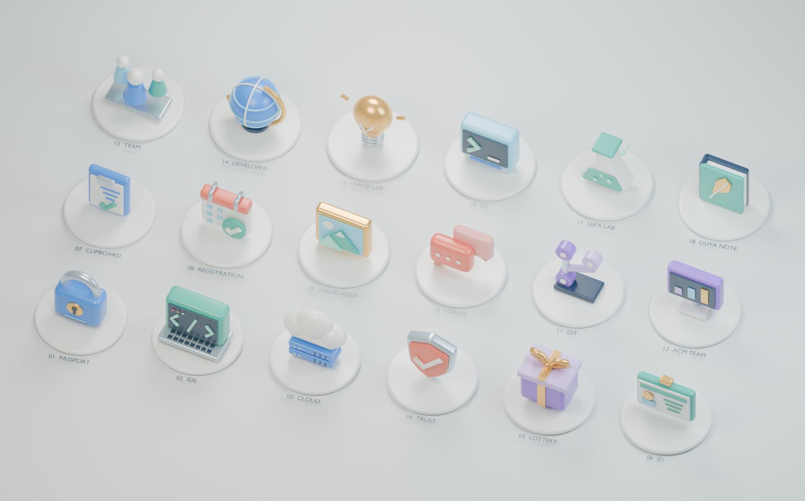

# Blender 服务模型

18 个服务分别拥有独立建模的实体雕塑。2D 列表、搜索及详情的小图标继续使用原有 SVG；三维视图加载 Blender 导出的 GLB。

## 资产与维护

- `design/blender/navigation-sculptures.blend`：可编辑的 Blender 源文件，包含全部模型、陈列台、灯光及总览相机。
- `scripts/blender/build_models.py`：完整建模和导出脚本，所有几何均为原创程序建模，无外部素材或纹理依赖。
- `public/models/navigation-sculptures-v1.glb`：网页使用的 18 个具名模型。节点名与服务 slug 一一对应。
- `public/models/navigation-sculptures.json`：Blender 版本、各模型尺寸和三角面统计。

在仓库根目录运行（Blender 5.2+）：

```sh
mkdir -p artifacts
blender --background --python scripts/blender/build_models.py -- "$PWD"
```

脚本在独立后台 Blender 进程中生成模型、导出 GLB、保存源文件，并将总览渲染到 `artifacts/blender-models-contact-sheet.png`。不要直接在含有未保存工作的 Blender 场景中执行该脚本。

修改模型时重新生成 GLB；后续发布请递增资产文件名版本，并同步组件和测试中的路径，避免 CDN 缓存旧模型。

## 设计

统一圆润倒角、陶瓷色面及金属细节。通行证用实体锁具、IDE 用笔记本、云服务用云朵与机架、信任中心用盾牌、抽奖用礼盒、ID 用身份卡；其他入口分别采用剪贴板、日历、图片画框、对话气泡、分支节点、显示器、团队人像、地球仪、灯泡、终端、烧瓶和笔记本。

模型正面朝 GLB 的 +Z，Y 轴向上。模型围绕世界 Y 轴朝向镜头，但保持直立，不跟随镜头俯仰压平。悬停抬升、选中轻转；减少动态效果时直接使用静态姿态。

## 网页渲染

`BlenderServiceModel` 加载同一份 GLB，克隆节点变换并共享几何与材质。颜色储存在顶点属性中，只使用陶瓷和金属两类材质，限制绘制开销。整套模型低于 5 万三角面、36 个材质 primitive、3 MiB 原始传输大小。

正交相机保持前后模型大小一致；总览、分类、单个服务分别按显示区域缩放。桌面留出标题及底部分类栏空间。选中服务仅显示对应模型，详情面板移至左侧。移动端沿用设备能力判断和 2D 默认模式。

GLB 的异步加载在 Canvas 内部 Suspense 中处理，避免模型加载导致整个 Canvas 重建。下载失败和 WebGL 上下文丢失仍回退到完整的 18 个服务入口。光照与反射环境均在本地生成，不请求外部 HDRI。

## 验证

- `blenderModels.test.js` 解析实际 GLB，检查所有服务节点、法线、索引、顶点颜色、几何厚度及资产预算。
- E2E 验证真实 Blender Mesh 加载、搜索选中、110 次绘制上限以及模型请求失败的 2D 回退。
- UI 截图检查浅色、深色、分类、详情及移动端；总览图使用与网页相同的导出网格。


